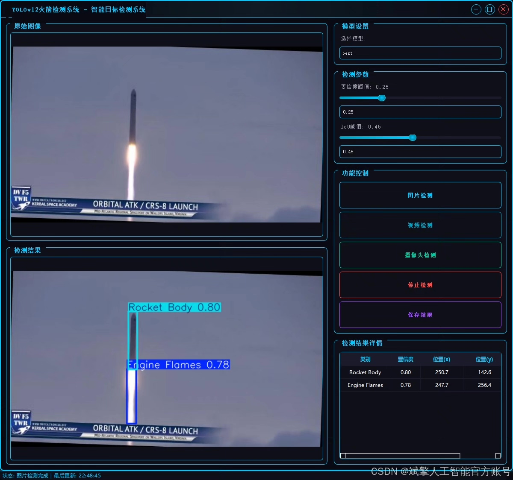
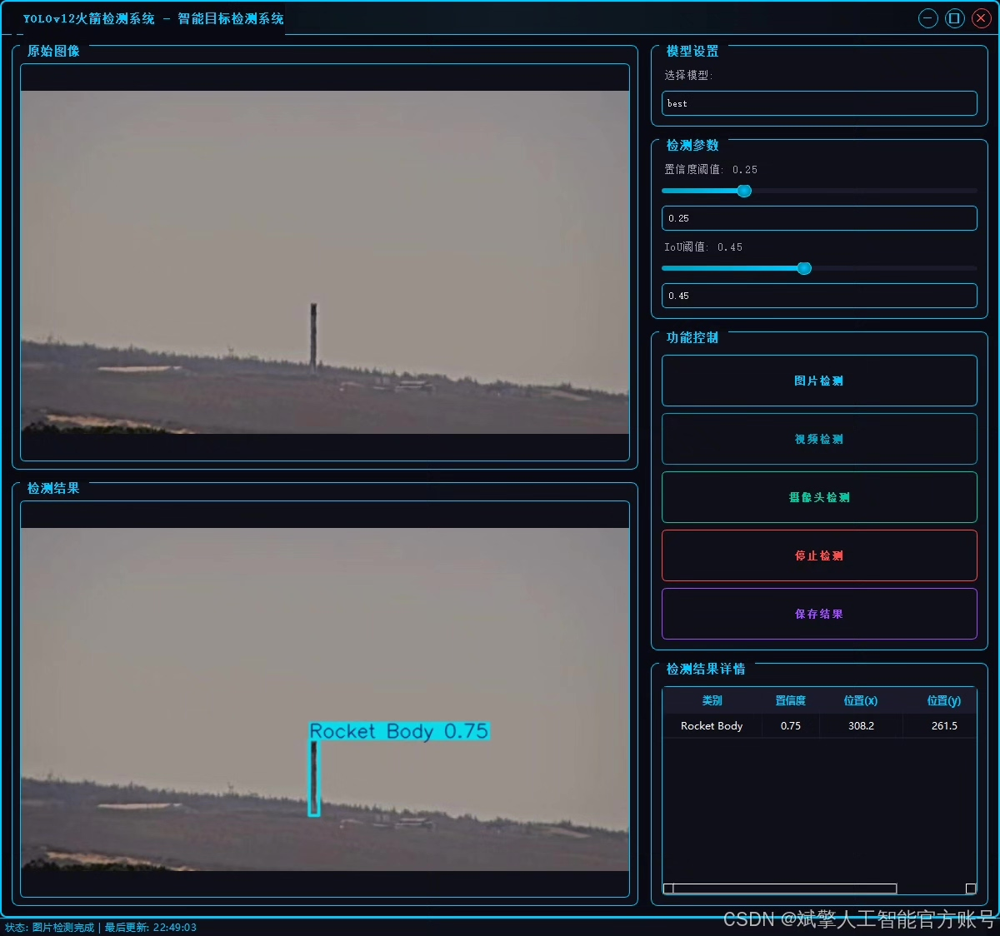
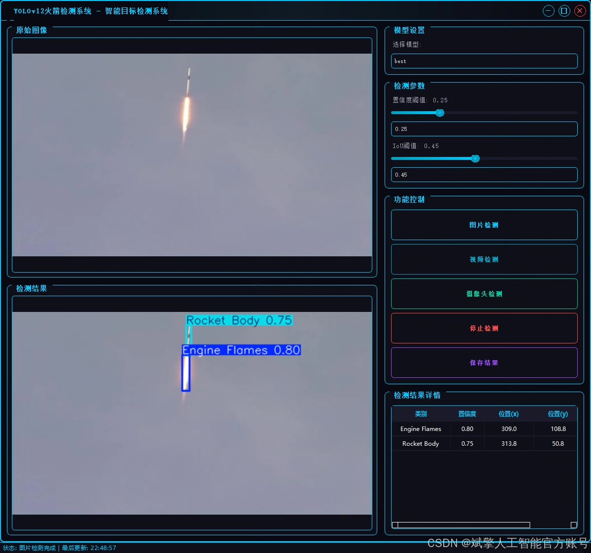
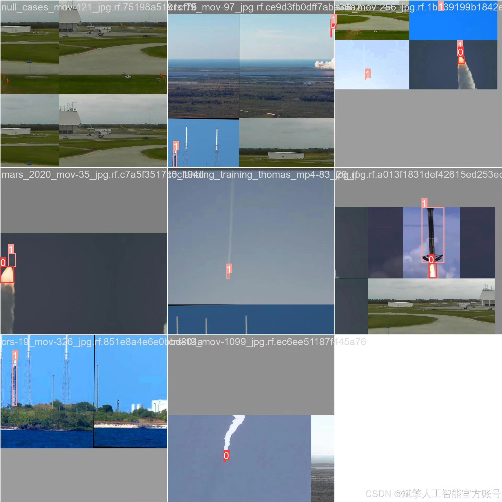
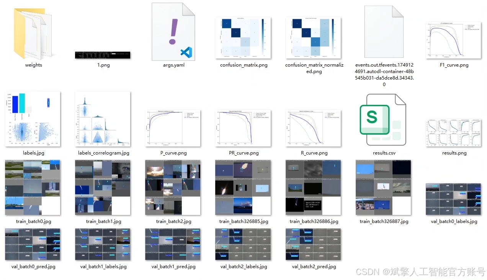
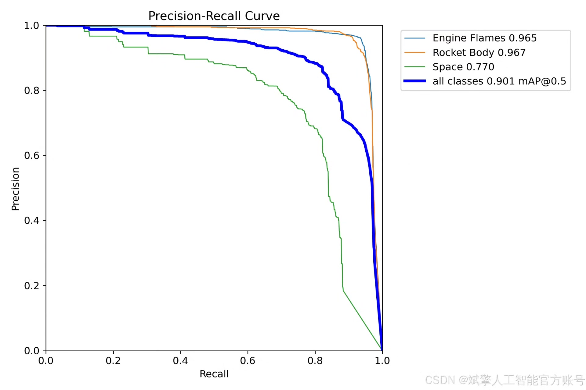
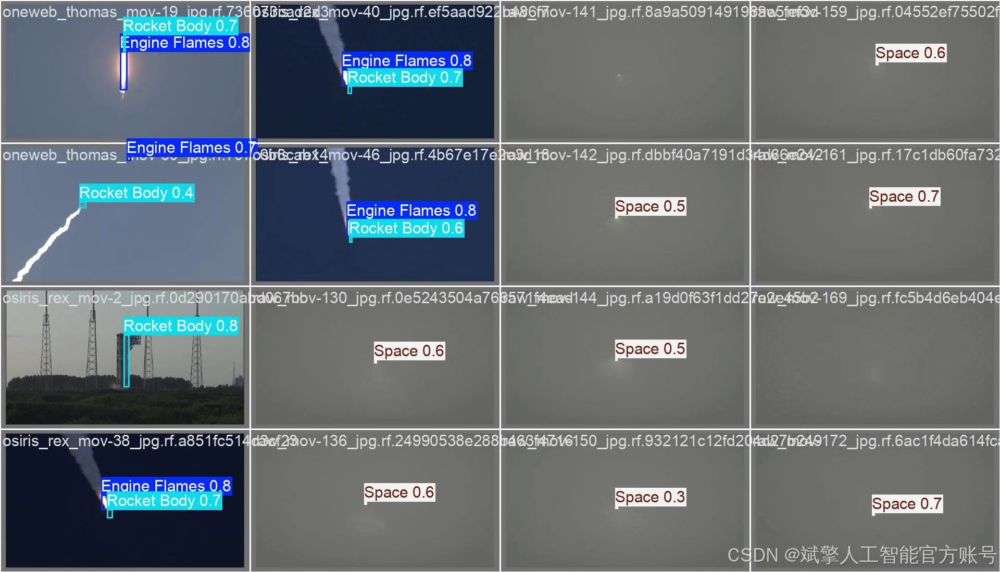
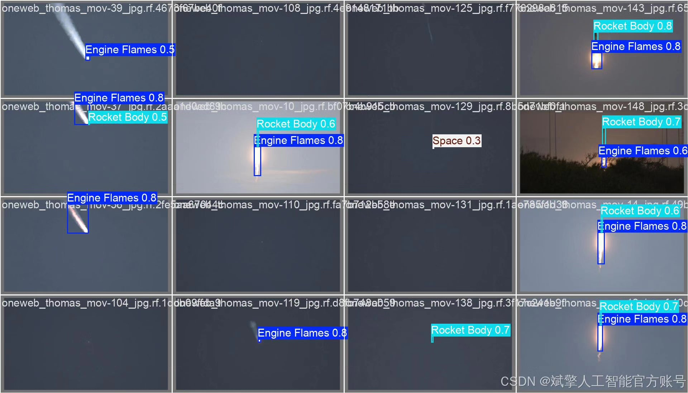
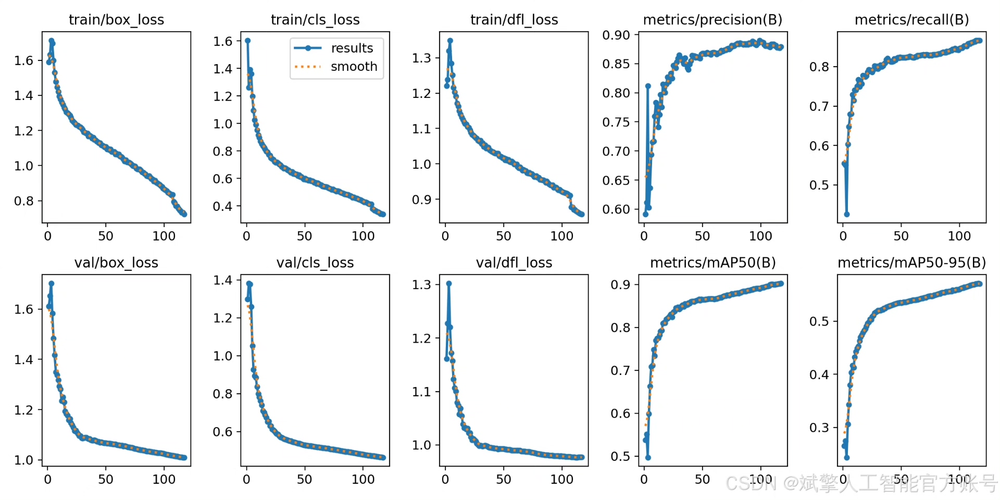

# YOLOv12 Rocket Part Recognition System

## Body

YOLOv12 Rocket Component Recognition System, based on deep learning YOLOv12, a recognizable system for rocket components (YOLOv12+YOLO dataset + UI interface + login registration interface + Python project source code + model).

The purpose of this project is to develop an intelligent recognition system for rocket components based on the advanced target detection model YOLOv12. This system can accurately and real-time detect and recognize three key categories in images or video streams: engine flames (Engine Flames), rocket body (Rocket Body) and Space. Through training and validation on large-scale, high-quality datasets, the model demonstrates strong feature extraction capabilities and excellent generalization performance, effectively addressing challenges such as variable scales of targets in space environments and complex backgrounds. This system can be widely applied in aerospace monitoring, in-orbit spacecraft status analysis, and tracking of space debris, providing core technical support for automated and intelligent space situation perception.

Dataset:
nc: 3
names: ['Engine Flames', 'Rocket Body', 'Space'],
dataset quantity: 24435 training set, 2428 validation set, 1286 test set

✅ User login registration: Support password detection and security verification.
✅ Three detection modes: Based on YOLOv12 model, supporting image, video, and real-time camera detection, accurate recognition of targets.
✅ Dual screen comparison: Display original scene and detection results on the same screen.
✅ Data visualization: Real-time table displaying detection targets' categories, confidence, and coordinates.
✅ Intelligent parameter adjustment: Offering a confidence slide bar, dynamically optimizing detection accuracy to meet different scene needs.
✅ Sci-fi style interface: Dark theme combined with dynamic light effects, reducing visual fatigue and improving operational experience.

## Images

## Payment

Here is a pay link on Stripe ( https://buy.stripe.com/3cs8yP7sY87d0vu9AB ). Please contact me lonlonago@foxmail.com after funding $89, and I will send you a complete data files , thank you!

